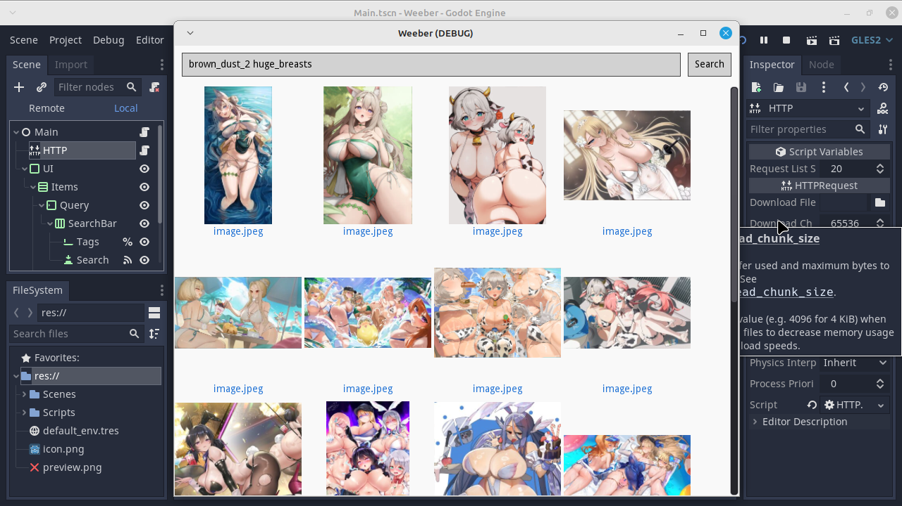

# Weeber
An imageboard test with Godot and Gelbooru's API.

## Testing
Enter your Gelbooru API and user ID to `var user_key` first in this format: `&api_key=API_KEY_HERE&user_id=USER_ID_HERE`.

So it will look like: `var user_key := "&api_key=MY_API_KEY&user_id=MY_ID"`.